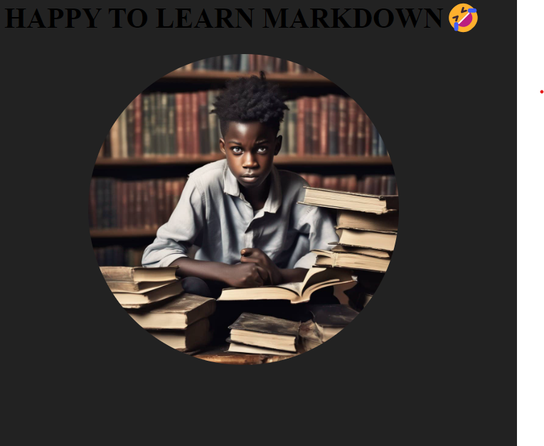

# A SIMPLE WEBSITE ABOUT MY PROFILE👋
## A simple website showcasing my profile as a developer💻


<p>Lorem ipsum dolor sit amet consectetur adipisicing elit. Fugiat nulla quas fugit minima quae quibusdam porro explicabo. Sequi tempora, similique exercitationem delectus officia tenetur porro consequuntur totam debitis incidunt provident.</p>

## how to return this project <mark>locally</mark>😆

this is a bold text

<!-- now lets look at italic -->

This text is *italics*

This project is like H<sub>2</sub>0 in chemistry, you cannot do without it and growing like the function e <sup>X</sup> in maths

please i want you to edit the footer but not the ~~navbar~~

```js
const x=4;
const y=3;
console.log(x+y)


```

## PYTHON CODE NOW

```js
def calculate(x+y);
return x+y

```


## contribusion section

In this project please do not touch the ~~header1~~
you can add modification in the
1. header2
2. The pyhton code
3. paragraph tag


## find me section👱
[linkedin](https:likedin.com)


[facebook](https:facebook.com)


[instagram](https:instagram.com)




